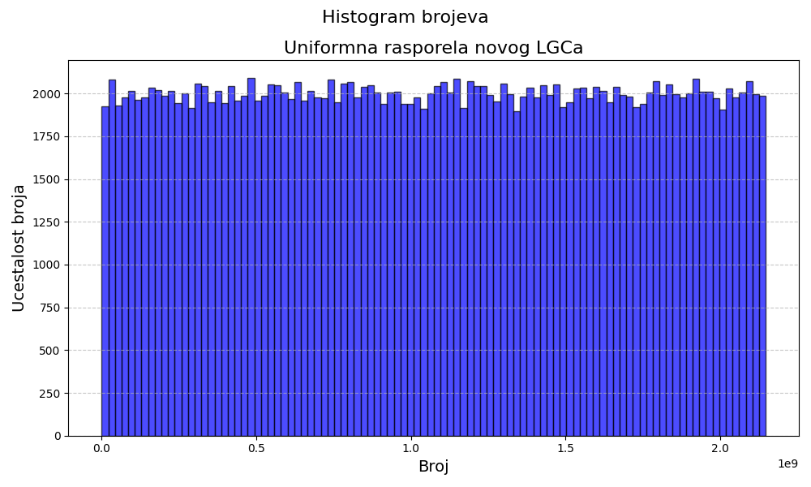
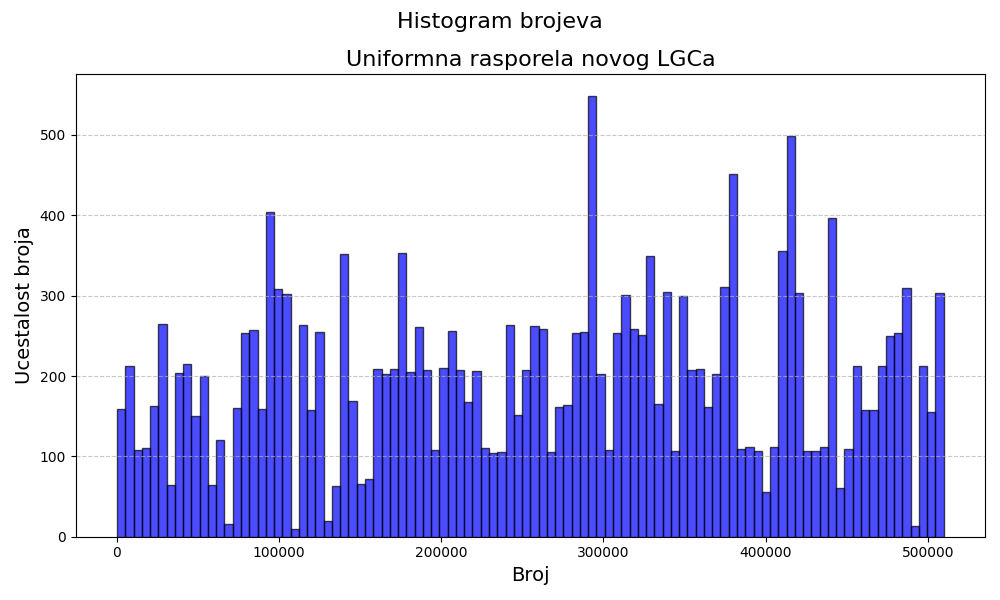
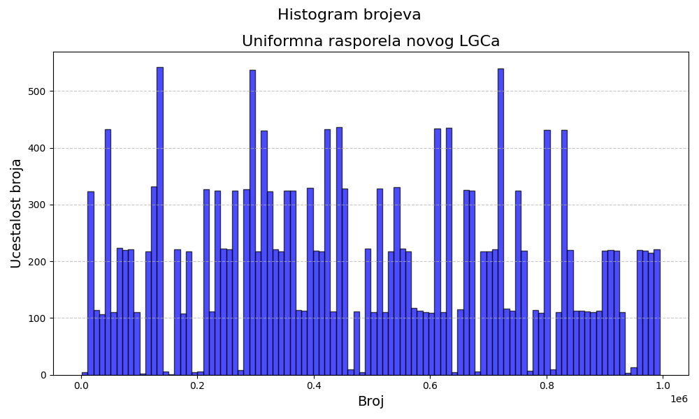
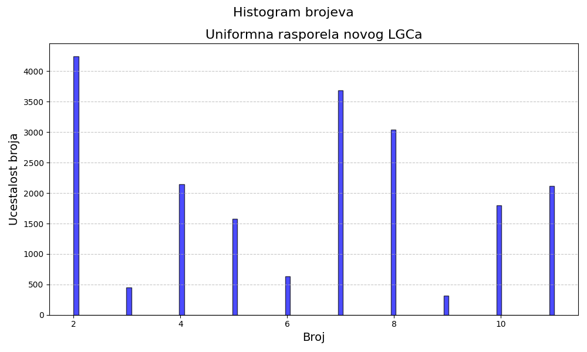

# Zakljucak o Linear Congruential Generatorima (LCG)

Linear Congruential Generatori (LCGs) su popularni generatori pseudonasumicnih brojeva koji koriste jednostavne matematicke operacije, poput modula pri deljenju za generisanje random brojeva. Iako su LCG-ovi efikasni i lako implementirani, oni imaju znacajne slabosti zbog kojih se retko koriste u sigurnosnim sistemima i kod sifrovanja poruka, ili kriptografiji.


- ## Formula

  
  X_{n+1} = (a * X_n + c) \mod m
  

  Gde su:

  - **\(X_{n+1}\)**: sledeci pseudo-slucajni broj u sekvenci
  - **\(X_n\)**: trenutni broj u sekvenci (početna vrednost \(X_0\) naziva  seed).  
  - **\(a\)**: **Multiplikator** (obicno veliki prost broj).  
  - **\(c\)**: **Aditivna konstanta** (cesto neparan broj).  
  - **\(m\)**: **Moduo** (maksimalna vrednost niza, obicno veliki stepen broja 2).

## Glavne slabosti LCG

### 1. 
   - LCG-ovi su predvidivi, sto znaci da za dati skup parametara (multiplikator `a`, inkrement `c`, modulus `m` i pocetni broj, start `x₀`), sekvenca generisanih brojeva je potpuno predvidiva. Ukoliko haker zna dovoljno podataka o izlazu ili internim delovima formule, kao sto su parametri a,c,m ili `x₀` , moze lako predvideti buduce i prethodne vrednosti.
   
   - Period, sekvenca brojeva LCG-a (broj generisanih brojeva pre nego što se ponovi) zavisi od izbora parametara, a period moze biti relativno kratak. Za mnoge sigurnosne aplikacije je potreban dugi ili cak beskonacan period da bi se sprecila predvidljivost tokom vremena.

### 2. 
   - LCG-ovi mogu pokazivati i druge lose osobine. Za odredjene parametre, najcesce suvise male, raspodela generisanih brojeva moze biti neuniformna, sto znaci da se neki brojevi pojavljuju cesce od drugih. U mom primeru, za neke manje dvocifrene ili jednocifrene brojeve (u kodu su pod komentarom) raspodela je bila "uniformna" samo za 10tak brojeva koji su se iznova ponavljali, dok ostali brojevi nisu postojali, time urusavajuci uniformnu raspodelu.
   
   - U kriptografskim sistemima, visokokvalitetna nasumicnost je kljucna za kreiranje sigurnih kljuceva, pocetnog broja, brojeva za inicijalizaciju, itd. LCG-ovi nisu dizajnirani da proizvode kriptografski sigurnu nasumicnost, jer njihove sekvence mogu biti lako predvidljive ili rekonstruisane.

## Zasto LCG-ovi nisu pogodna opcija za sigurnosne sisteme i modeernu kriptografiju?

Zbog svoje predvidljivosti, kratkog perioda pre ponavljanje sekvence brojeva, i lakoce za pronalazak sablona formule kojom se LCG generise, LCG-ovi nisu pogodna opcija za kriptografske sisteme i sigurnosne aplikacije koje zavise od random, nepredvidivih brojeva. Umesto njih, koriste se kriptografski sigurni generatori random brojeva (CSPRNG), koji garantuju vecu sigurnost u pogledu nasumicnosti i zastite od napada:

**SHA-256 (256-bitni hash algoritam)**: Ovaj algoritam generise random brojeve iz kriptografski sigurnih hes funkcija. Koristi se u samom Bitcoinu i drugim blockchain sistemima.

**AES (Advanced Encryption Standard)**: AES moze biti koriscen u **CTR (Counter)** rezimu kao CSPRNG. U ovom rezimu, AES koristi brojac koji se konstantno povecava, a taj broj se sifruje pomocu AES kljuca da bi se generisali random brojevi. Ovaj metod je siguran i vrlo efikasan.

**Hardware Random Number Generators (HRNG)**: Ovi generatori koriste fizicke osobine takozvane: nesigurnosti, npr. radijacija**, **neki toplitni sum ili kolicina zracenja okoline za proizvodnju brojeva. Ovi generatori mogu ponuditi visoko kvalitetne random brojeve, ali su skuplji za implementaciju i zavise od specijalizovanog hardvera i preciznih senzora.


U mnogim slucajevima, CSPRNG koristi izvor entropije iz spoljnog sveta da generise inicijalnu vrednost onog `x₀` pocetnog broja. To moze biti trenutni vremenski period, neki vid signature (potpisa) izerazeno u visokoj prezicnosti (vreme u milisekundama), racunarska aktivnost (kao sto je vreme procesora, BIOSA, broj procesa, threadova, taskova na PC-u koji se znaju brzo menjati) ili fizicki izvori entropije/nesigurnosti (kao sto su sumovi u elektricnim kolima). Jedan od kljucnih pojmova vezanih za CSPRNG-a je upotreba hash funkcija, kao sto je **SHA-256**. Na primer, pocetni entropijski izvor se sifruje kroz hash funkciju, a rezultati se koriste kao dalji izvor entropije/nasumicnosti za generisanje sledecih brojeva, time dodavajuci mnogo vecu kompleksnost svakoj narednoj iteraciji i svakom narednom broju.

### Plotovi raspodela

Originalni LCG sa parametrima:

```
int xn = 1;
int a = 1664525;   
int c = 1013904223; 
int m = (int)Math.Pow(2, 31); #2^31 modul za deljenje
```

je davao sledecu raspodelu:




U kojoj se vidi da je zadovoljena osnovna potreba za uniformnom raspodelom. Ukoliko se zamenio modul za deljenje (Program_upgrade.cs), da bude zasnovan na milisekundama pokretanja programa cime bi se poboljsala nasumicnost generisanja brojeva nova raspodela bi izgledala ovako:



Kada bi se na to dodali da c bude zavistan u odnosu na broj procesa koji racunar koji pokrece program trenutno ima, plot bi izgledao ovako nekako:




Iako je urusena uniformna raspodela originalnog LCG-a, "unapredjeni" random number generator donosi vecu nesigurnost kod biranja brojeva, ali smanjuje raspodelu da ce se svaki broj jednako birati. Uzevsi u obzir da je opseg izuzetno velik, a moze se i prosiriti ovo narusavanje raspodele nema toliko drastican uticaj. 

Na kraju, ukoliko bi se koristio originalan pristup generisanju RNG-a pomocu broja trenutnih procesa (koji je za svaku masinu koja pokrece kod zaseban) i preciznog vremena izvrsavanja programa, a uz pomoc kombinacije XOR operacije nad bitima generisanih brojeva mogao bi se dobiti primitivni generator:



Ovaj RNG generise 10 brojeva u opsegu od 2 do 11, a modifikovanjem dodatnog dela u kodu gde se getXOR() operaciji dodaje 2
```
for (int i = 0; i < 20000; i++)
{
    int randombroj = getXOR()+2;
    qwerty.WriteLine(randombroj);
}
```

moze se centrirati u kom ce se opsegu nalaziti generisani brojevi (gde ce najveci biti za 9 veci od najmanjeg).

Za generisanje grafika u cilju prikaza distribucije brojeva koriscen je main.py python kod koji je prikazivao niz brojeva zapisanih u txt fajl.

### Zakljucak

Iako LCG-ovi mogu biti efikasni u odredjenim simulacijama i igrama gde  dobra nasumicnost nije kljucna ili kriticna, njegova predvidljivost i slabosti u bezbednosnim sistemima cine ga neadekvatnim za upotrebu u kriptografiji. S obzirom na ove slabosti, kriptografski sistemi prepoznaju potrebu za slozenijim, kompleksnijim i sigurnijim generatorima, koji mogu garantovati visoku nasumicnost i otpornost na napade.

